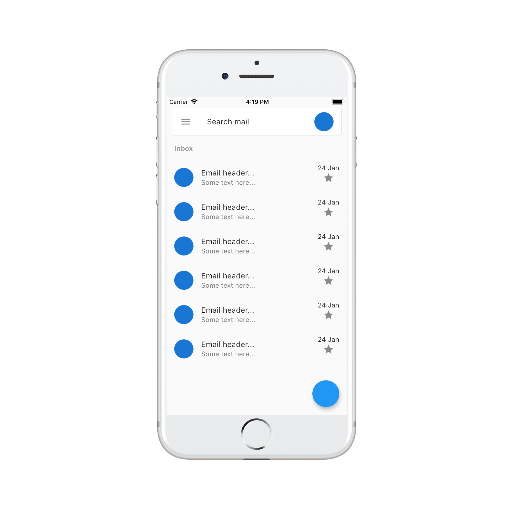

# Flutter Training - Session 2

This session was focused on building UI layouts and what should be the thinking process when tasked with replicating a design.

## Description

Following application demonstrates building layout for gmail app home page.

## Application

